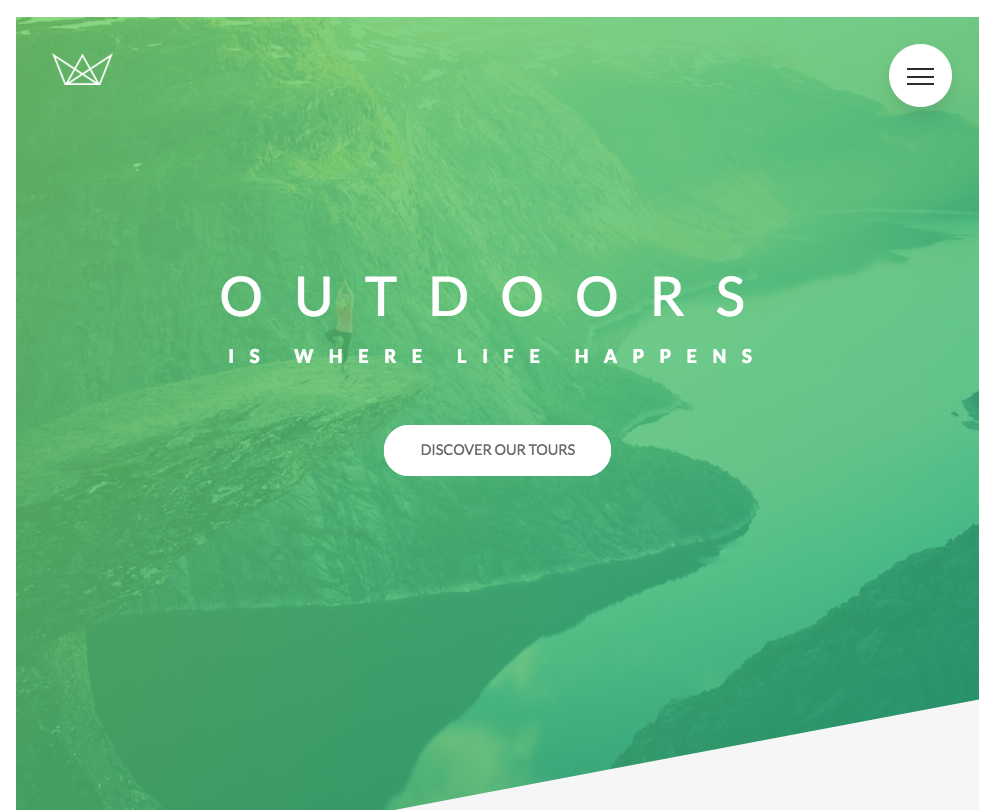
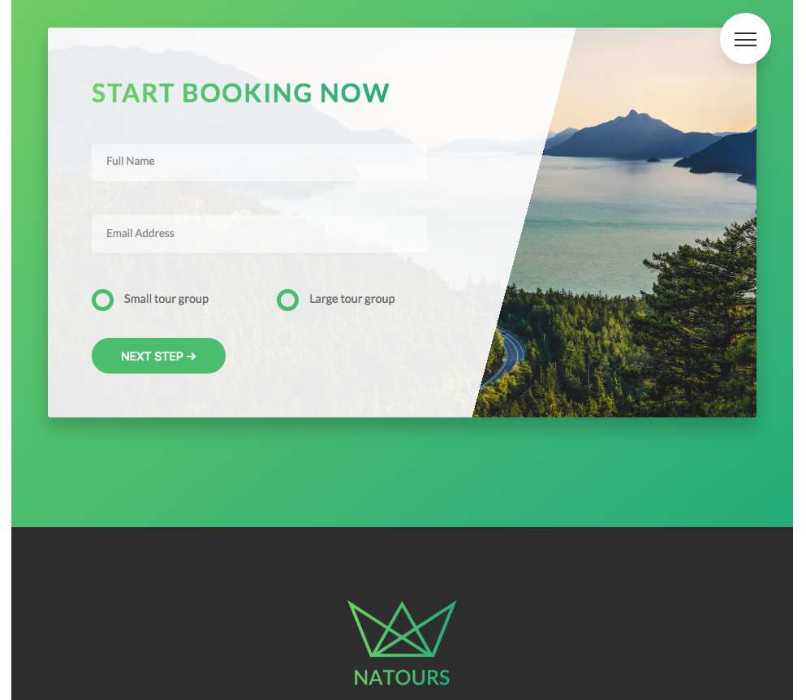

## Natours
An Advanced CSS project focusing on SASS fundamentals and Float Layout.

## Project Screen Shots

[ PRETEND OTHER SCREEN SHOT IS HERE ]

## Installation and Setup Instructions
Clone down this repository. You will need `node` and `npm` installed globally on your machine.  
##### Installation:

`npm install`  

##### To Start Server:

`npm start`  

## Reflection
This was a project built during the [Udemy Course: Advanced CSS & SASS: Flexbox, Grid, Animations and More!](https://www.udemy.com/advanced-css-and-sass/) Project goals included... 

* SASS fundamentals
* BEM Methodology
* Float layouts (Grid Layout)
* Relative/Absolute Positioning
* CSS animations
* Responsive Design
* Font-size rem/em units

One of the key learning lessons from this project was the importance of CSS code structure. Seperation of Concerns is a key component to a maintainable codebase. Having a dedicated file to common CSS values `_variables.scss` was very important for this project.